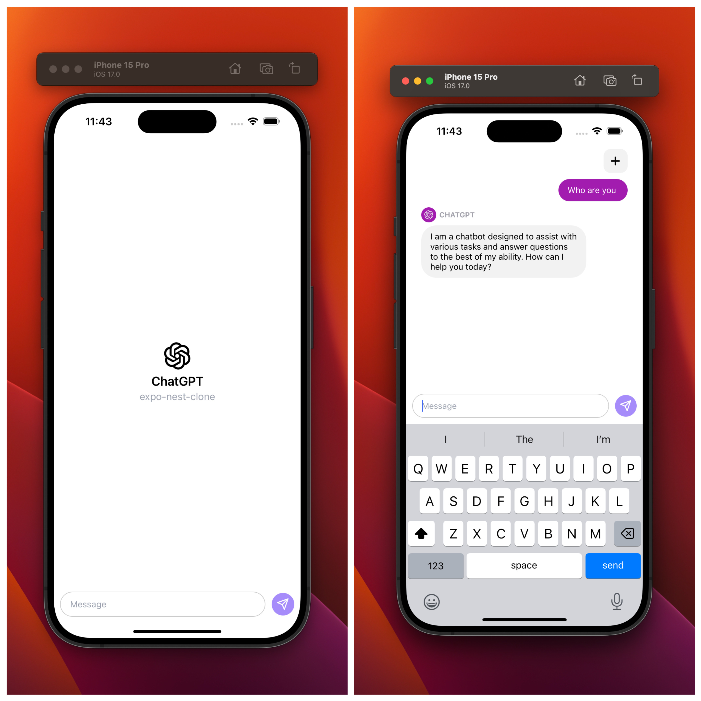

# ChatGPT-Expo-Nest

A ChatGPT clone using Expo, NestJS, and OpenAI's GPT-3.5 turbo api.


## Usage

### 1️⃣ : Start Backend

```bash
cd backend
pnpm install
```

And create .env file from .env.example and set your OpenAI API key. Then:

```bash
pnpm run start:dev
```

### 2️⃣ : Run Expo in Simulator

```bash
cd client
pnpm install
pnpm run ios
```
